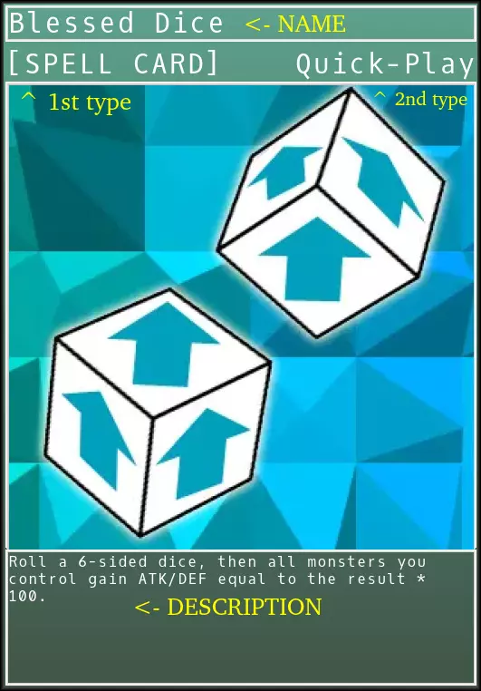

Spells and Traps
================

The game also features Spells and Traps cards that drastically change the battlefield. Let's review what the card consists of.

* **Card Name**

* **(First) Card Type**. Defines whether the card belongs to the Spells or Traps group.

* **(Second) Card Type**. Defines the subgroup (this determines the cards ability to act).

* **Description**. Defines the performed effect of the card.

------------
Spell Types:
------------

* **Normal** (no Second Type). Can only be activated during Main Phase 1 or 2 on the designated field (you can also place it face-up vertically to try to scare your opponent into thinking it's a trap card). Once it is activated (by showing it in Face-up position on the appropriate field), it goes into the graveyard.

* **Quick-Play** is a type of spell that can be activated on any turn. You can activate it from your hand (during any phase) during your opponent's turn if it is in face-up position on the field. After activation, the card goes to the graveyard.

* **Continuous** works continuously on the field until it is destroyed.

* **Ritual** is a card that can be activated during the main phases of a turn. You must also have the ritual monster the card refers to and a sufficient number of monsters to tribute (in hand or on the field) of a level equal to or higher than the summoned ritual card. 

* **Equip** is a type of spell that you assign to a (Face-up) monster. When the monster is destroyed, destroy that card as well.

* **Field** is a special type of spell with a dedicated field on Battle Arena. Each opponent can only have 1 of this type of card activated at a time. The card works on the entire arena and usually modifies the stats of monsters. It works as long as it is on the field.

---------------
Types of Traps:
---------------

* **Normal** (no second Type). Can only be activated (per phase) on the next turn from Set. After activation, it goes to the Graveyard.

* **Continuous** works just like a normal trap, but once activated, it stays on the field until destroyed.

* **Counter** is a type of trap that can be activated when an opponent activates a spell / trap type card. They are used to negate actions.