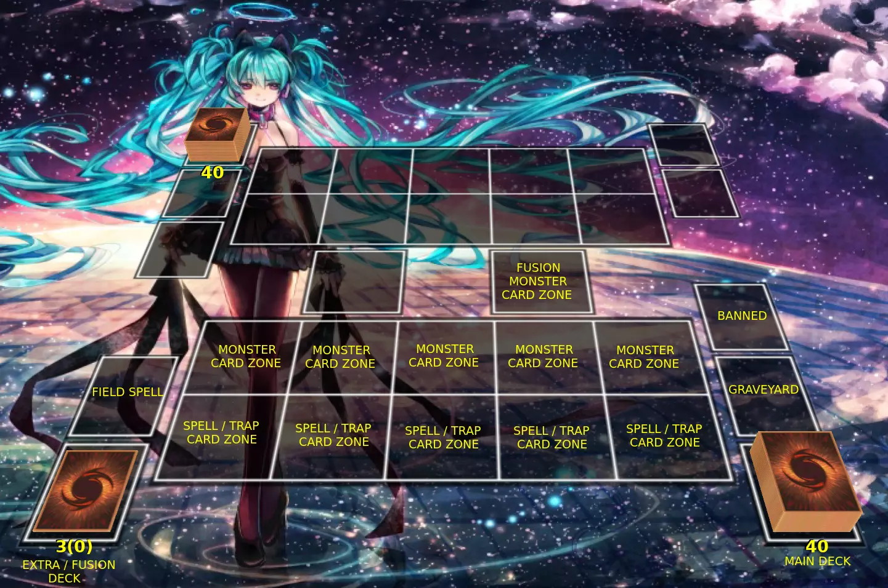

Arena Bitwy
===========

Arena Bitwy gry Summoned Monsters składa się z 8 elementów, które zostaną tutaj omówione.

* **Główna talia** (Main Deck), czyli talia z której ciągniemy karty.

* **Extra / Fusion talia** (Extra / Fusion Deck), czyli talia specjalnie przeznaczona na potwory fuzyjne.

* **Cmentarz** (Graveyard), czyli miejsce gdzie domyślnie zniszczone potwory i zużyte czary / pułapki trafiają. Różni się tym od "Banned", że część kart pozwala przywrócić z tego miejsca karty do gry, np. Revival.

* **Wyrzucone z gry** (Banned), karty stąd ostatecznie są podczas meczu wyrzucone i nie mogą w żadnej formie wrócić na pole gry.

* **Pole Czarów / Pułapek** (Spell / Trap Zone) to pola na których używamy czarów i pułapek.

* **Pole potworów** (Monster Card Zone) to pola na które przywołuje się potwory biorące udział w bitwie.

* **Pole czarów środowiskowych** (Field Spell Zone), to miejsce gdzie aktywuje się karty czarów mających atrybut Field.

* **Pole potwora Fuzyjnego** (Fusion Monster Card Zone) to pole, które specjalne pole na potwora Fuzyjnego, który został przyzwany za pomocą karty "Fusion".